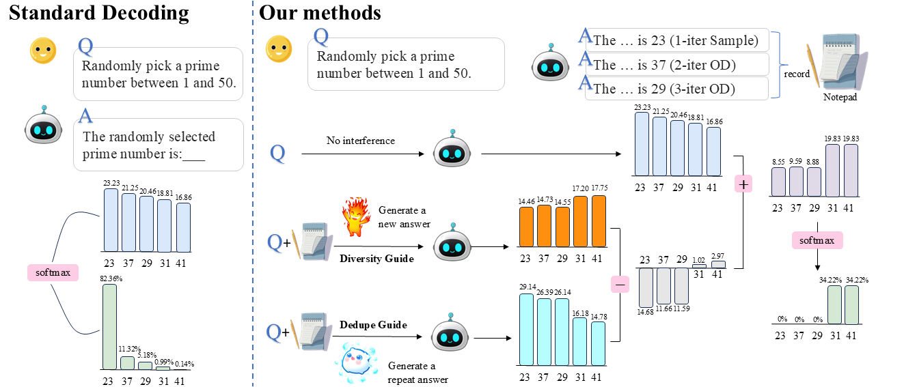

# G2: Guided Generation for Enhanced Output Diversity in LLMs



> **🎉 Accepted at EMNLP 2025 Main Conference**

## Abstract

Large Language Models (LLMs) have demonstrated exceptional performance across diverse natural language processing tasks. However, these models exhibit a critical limitation in output diversity, often generating highly similar content across multiple attempts. This limitation significantly affects tasks requiring diverse outputs, from creative writing to reasoning. Existing solutions, like temperature scaling, enhance diversity by modifying probability distributions but compromise output quality. We propose **Guide-to-Generation** (G2), a training-free plug-and-play method that enhances output diversity while preserving generation quality. G2 employs a base generator alongside dual Guides, which guide the generation process through decoding-based interventions to encourage more diverse outputs conditioned on the original query. Comprehensive experiments demonstrate that G2 effectively improves output diversity while maintaining an optimal balance between diversity and quality.


## Project Structure

```
g2/
├── modeling/
│   └── dexperts_entropy.py      # Core G2 implementation
├── eval/
│   ├── novelty-bench/           # NoveltyBench evaluation
│   ├── wmt/                     # WMT translation evaluation
│   ├── xlsum/                   # XLSum summarization evaluation
│   ├── diversity/               # Diversity metrics
│   └── utils.py                 # Evaluation utilities
├── scripts/                     # Evaluation scripts
├── figure/                      # Paper figures
└── data/                        # Dataset configurations
```

# Environment Setup

We run the experiments on 8 NVIDIA A100-80G GPU.

Due to library conflicts between diversity evaluation and inference dependencies, we have separated the inference and diversity evaluation environments.
## Inference Environment
```
conda create -n g2 python=3.10
conda activate g2 
pip install torch==2.3.0 torchvision==0.18.0 torchaudio==2.3.0 --index-url https://download.pytorch.org/whl/cu121
pip install -r g2_requirements.txt
```
## Evaluation Environment
```
conda create -n g2_eval python=3.10
conda activate g2_eval 
pip install torch==2.3.0 torchvision==0.18.0 torchaudio==2.3.0 --index-url https://download.pytorch.org/whl/cu121
pip install -r g2_eval_requirements.txt
```

# Evaluation

## NoveltyBench Evaluation

For diversity and quality scores on NoveltyBench, you can use the following scripts:
```
conda activate g2
bash scripts/eval/novelty/run_eval.sh 0.3
```


## Additional Diversity Metrics

If you want to evaluate additional diversity metrics such as sentence-BERT, self-BLEU, and EAD, please execute:
```
conda activate eval_g2
python eval/calculate_div.py --file outputfile=results/novelty/g2_theta0.3_temp1/generations.jsonl --task curated
```


## Acknowledgments

We thank the excellent open-source libraries including:
- [Proxy-tuning](https://github.com/alisawuffles/proxy-tuning)
- [NoveltyBench](https://github.com/novelty-bench/novelty-bench)

And other outstanding works that contributed to this research.

## Citation

If you find this work useful, please cite our paper:

```bibtex
@inproceedings{g2-guided-generation-2025,
    title={G2: Guided Generation for Enhanced Output Diversity in LLMs},
    author={Zhiwen Ruan and Yixia Li and Yefeng Liu and Yun Chen and Weihua Luo and Peng Li and Yang Liu and Guanhua Chen},
    booktitle={Proceedings of the 2019 Conference on Empirical Methods in Natural Language Processing},
    year={2025},
    publisher={Association for Computational Linguistics}
}
```